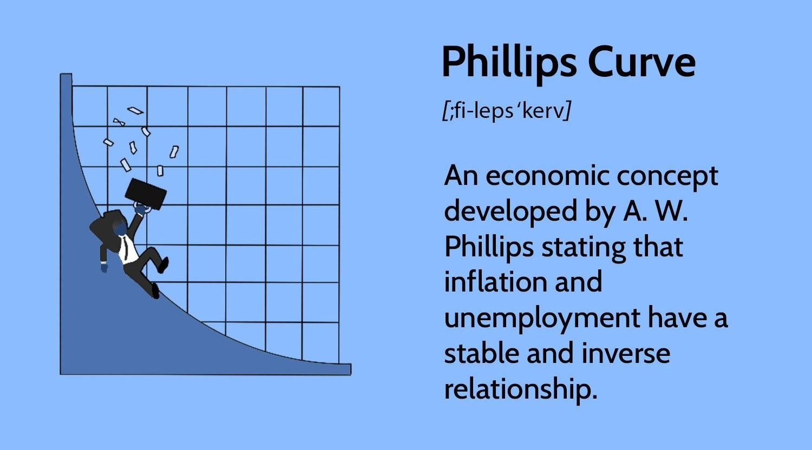

## 🏆 Projects

### [Factorial Analysis of Mixed Data (FAMD)](https://github.com/aurvl/Mes-Projets)
This project explores the application of Factorial Analysis of Mixed Data (FAMD) to the well-known "adult" dataset from the UCI Machine Learning Repository. FAMD is a powerful technique for dimensionality reduction that handles both quantitative and qualitative variables simultaneously. The aim of this project is to uncover the relationships between variables and individuals in the dataset by reducing its complexity, while retaining as much variance as possible. Through this analysis, we gain deeper insights into the structure of the data, which can inform further analysis and decision-making.

### [House Price Prediction](https://github.com/aurvl/Mes-Projets)
In this project, machine learning techniques are applied to predict house prices using a dataset that includes various housing features and area demographics. The objective is to develop a predictive model using linear regression and assess its performance in estimating house prices. Additionally, the project involves exploring the dataset through data visualization and analysis to gain a deeper understanding of the factors influencing housing prices.

### [Classification Models for Family History of Overweight](https://github.com/aurvl/Mes-Projets)
This project investigates the use of different classification models to predict whether an individual has a family history of overweight. Three machine learning algorithms are implemented and compared: Logistic Regression, Random Forest Classifier, and XGBoost Classifier. The main objective is to evaluate and contrast the performance of these models based on metrics such as accuracy, precision, recall, F1-score, and AUC-ROC.

### [Analysis of Economic Indicators: Okun's Law](https://github.com/aurvl/Mes-Projets)
This project analyzes key economic indicators, specifically GDP and unemployment rates, using data from Eurostat. The main objective is to explore the relationship between GDP growth and unemployment rates through the framework of Okun's Law. By applying this economic principle, we aim to understand how shifts in unemployment correspond to changes in GDP, providing insights into economic performance and trends over time.

### [Analysis of Belgian Exports and Imports (1995-2023)](https://github.com/aurvl/Mes-Projets)
This report presents an econometric analysis of Belgium's exports and imports. The study investigates the time series of Belgian foreign trade to understand historical trends, assess relationships between variables, and provide forecasts over a 10-quarter period. The report is divided into two main sections: a univariate time series analysis to explore individual characteristics and a multivariate analysis to examine the interactions between the various series.

### [Phillips Curve Analysis and Policy Guidance for Europe 2024](https://github.com/aurvl/Mes-Projets)
This Python project delves into the relationship between inflation and unemployment across five major European countries in 2023, with forecasts for 2024. Through econometric analysis and model estimation, the project aims to provide insights into economic trends and offer policy recommendations tailored to each country. By applying the Phillips Curve, the study explores the dynamic interaction between inflation and unemployment, presenting valuable projections for the upcoming year.

